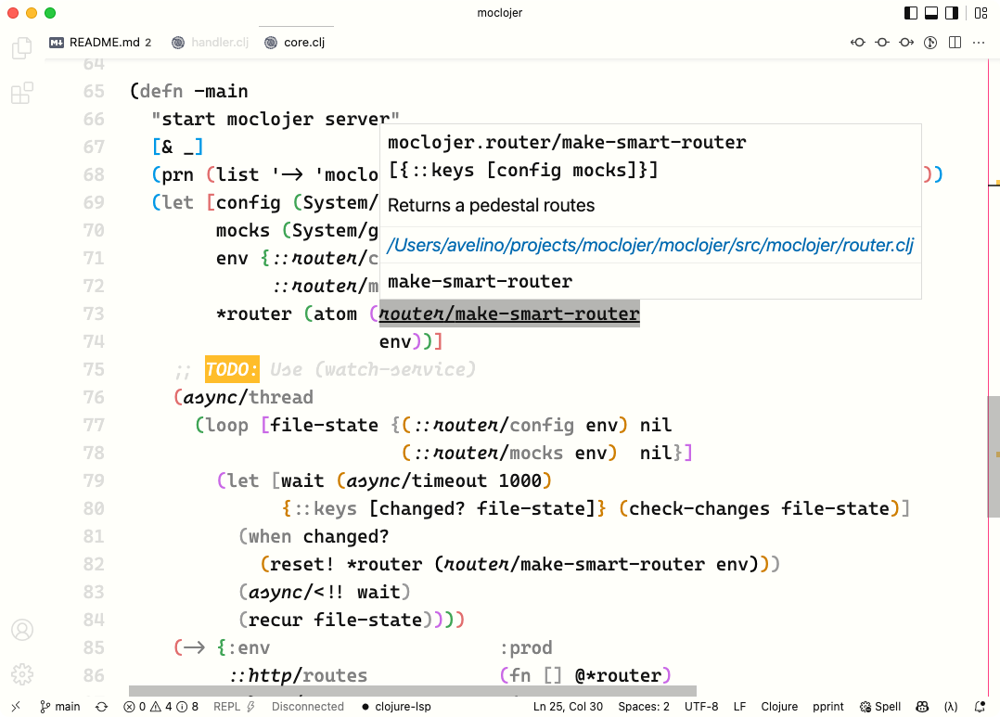
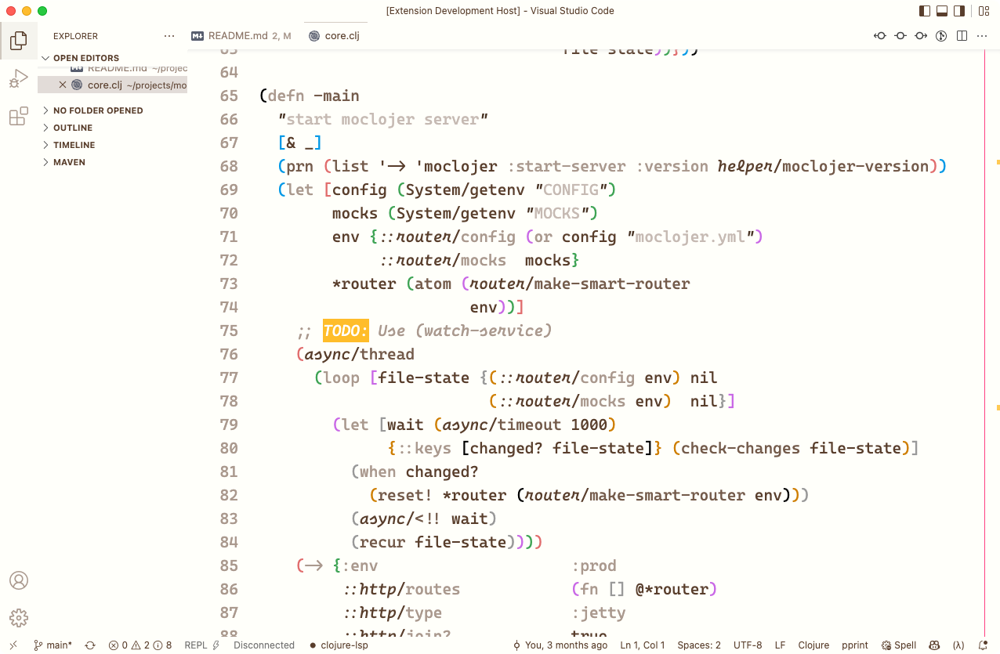

# monotropic for Visual Studio Code

(Almost) monochromatic theme for VSCode. Originally based on [caffo/monotropic-theme](https://github.com/caffo/monotropic-theme) (emacs).

[Install now 🛒](https://marketplace.visualstudio.com/items?itemName=avelino.monotropic-theme)

## Screenshots

### monotropic

### monotropic coffee

_Font used in screenshots is [Cascadia Code](https://github.com/microsoft/cascadia-code)_

## Color Palette

## Monotropic (default)

- `#111111` 
- `#808080` 
- `#ddddda` 
- `#fcfaf0` 
- `#fffffa` 

### Gradient

- `#111111` 
- `#606060` 
- `#b0b0b0` 
- `#d7d7d7` 
- `#fcfaf0` 
- `#fffffa` 

### Coffee

- `#593e2c` 
- `#745b4b` 
- `#8f796c` 
- `#aa998e` 
- `#c6bab3` 
- `#e2dcd8` 
