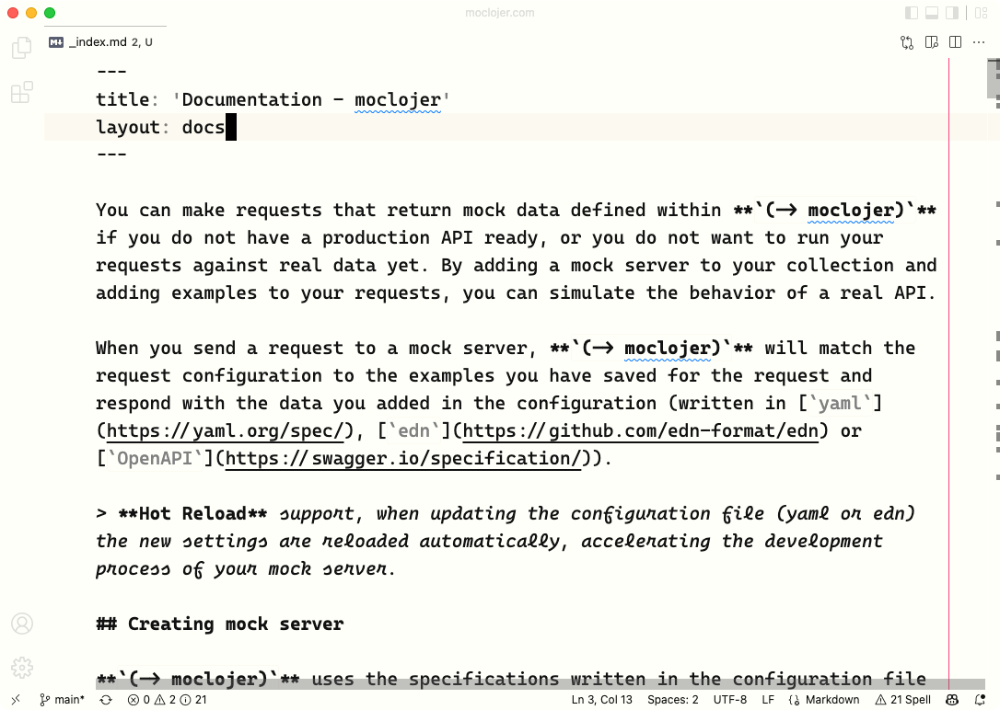
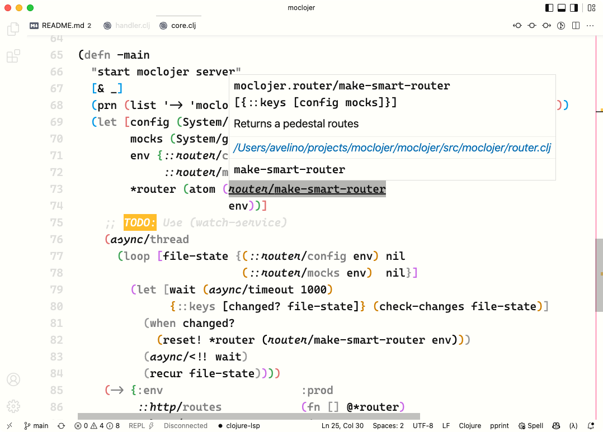
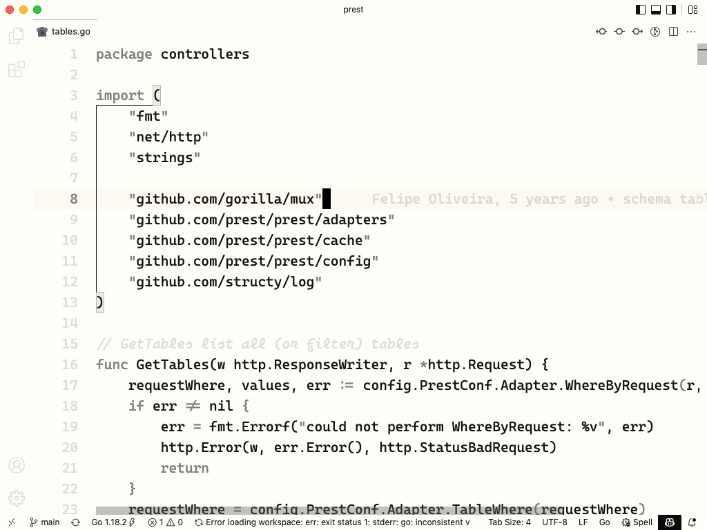
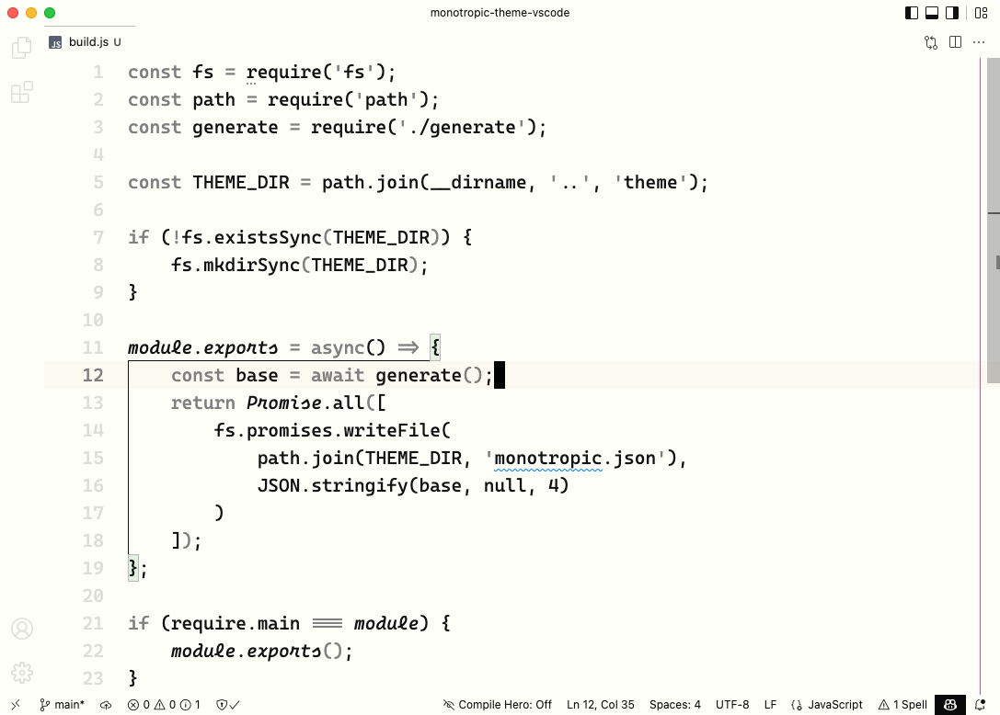

# monotropic for Visual Studio Code

(Almost) monochromatic theme for VSCode. Originally based on [caffo/monotropic-theme](https://github.com/caffo/monotropic-theme) (emacs).

## Screenshots

Font used in screenshots is [Cascadia Code](https://github.com/microsoft/cascadia-code)
